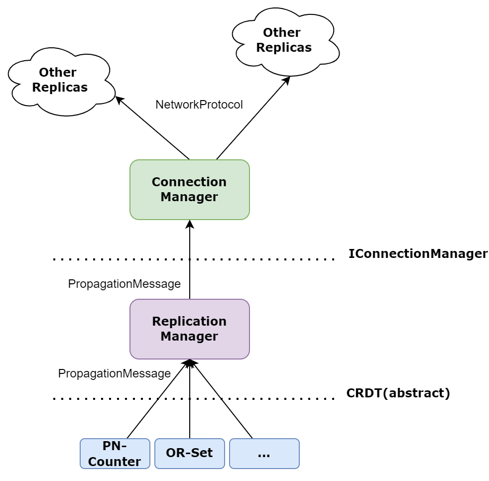

# MergeSharp

MergeSharp is a fast, lightweight and modular framework of Conflict-free Replicated Datatypes built for C# .Net. You can use it anywhere from IPC communication, to P2P collaborative systems thanks to its modularity. New CRDTs and communication methods can be easily added for extended capabilities that tailored to individual's need, and a portfolio of CRDTs are provided out-of-the-box.

## Overview

MergeSharp consists of three major components, the CRDT, the Replication Manager and the Connection Manager. 




In most cases, users only interact with an instance of a CRDT to performance CRDT operations such as updates and reads. CRDT classes can be instantiated and used directly, however users would need to performance replication and synchronization manually. All CRDTs inherits from the abstract base CRDT class.

The Replication Manager is where the magic happens, when creating and accessing CRDTs through the Replication Manager, it automatically handles replication and synchronization without the need to modify CRDTs themselves. In addition, each instance of the Replication Manager acts like a replica. Just execute an update on one instance like a standalone one, it is automatically sync'd to all other replicas.

The Connection Manager handles communication among replicas. It is agnostic to the Replication Manager, therefore it is possible to implement any kind of communication method/network topology (IPC or over the network, fully connected or P2P). Note that some CRDTs may require different delivery guarantees (TODO: maybe add capability flags to the Connection Manager?), you need to make sure the Connection Manager provides such guarantees.

## Examples

### Using a standalone PN-Counter
```
PNCounter pnc1 = new PNCounter();
PNCounter pnc2 = new PNCounter();

pnc1.Increment(5);
pnc2.Decrement(8);
pnc1.Increment(10);
pnc2.Decrement(3);

PNCounterMsg update = (PNCounterMsg) pnc1.GetLastSynchronizedUpdate();
pnc2.Merge(update);

pnc1.Get(); => 2
pnc2.Get(); => 2
```

### Using Replication Manager
```

ConnectionManager cm0; 
ConnectionManager cm1;
// ... ConnectionManager initialized elsewhere ...

// Create two replicas, in reality this could be running
// on different processes
ReplicationManager replica0 = new(cm0);
ReplicationManager replica1 = new(cm1);

// A CRDT must be registered to the Replication Manager before used
replica0.RegisterType<PNCounter>();
replica1.RegisterType<PNCounter>();

// When creating a CRDT instance with the Replication Manager, it is
// assigned with an GUID, so that it can be retrieved from other replicas
Guid uid = replica0.CreateCRDTInstance<PNCounter>(out PNCounter pnc0);

// Get the counter from the other replica
PNCounter pnc1 = replica1.GetCRDT<PNCounter>(uid);   

// conduct operations normally
pnc1.Increment(5);
pnc2.Decrement(8);
pnc1.Increment(10);
pnc2.Decrement(3);

// values are automatically sync'd
// Note that, if it is over the network, there may be some delay
// before you could get the same value because of the nature of
// eventual consistency in CRDTs and network latency
pnc1.Get(); => 2
pnc2.Get(); => 2
```


## CRDT Background

TODO

## HowTos
### Add a new CRDT

1. Create a CRDT class that inherits from `abstract class CRDT`, see comment for the methods that needs to be implemented.
2. Create a anti-entropy message type depending on the design of your CRDT, and inherits from `abstract class PropagationMessage`, see comment for the methods that needs to be implemented..
3. Implement your CRDT with your states, update operations and query operations.
4. For all the update operations methods, mark it with `[OperationType(OpType.Update)]` attribute.
5. Include relevant tests, benchmarks and documentation.
6. For generic types and collections, make sure supplied type is serializable.

### Add a new connection manager
TODO

## List of Built-in CRDTs
### PN-Counter
### Two-Phase Set


## Performance
